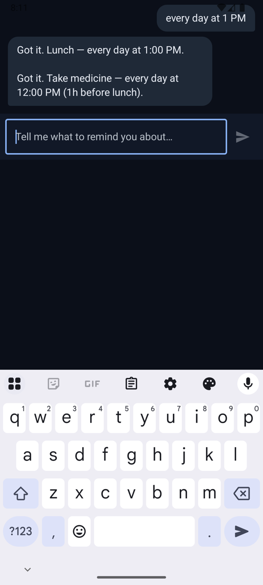
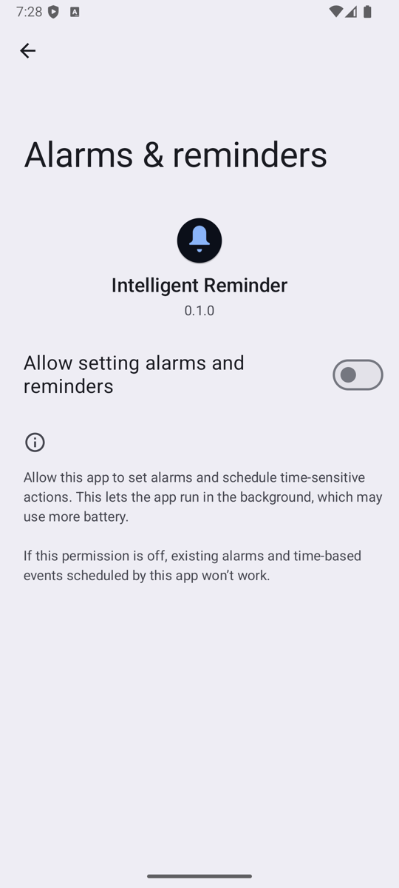
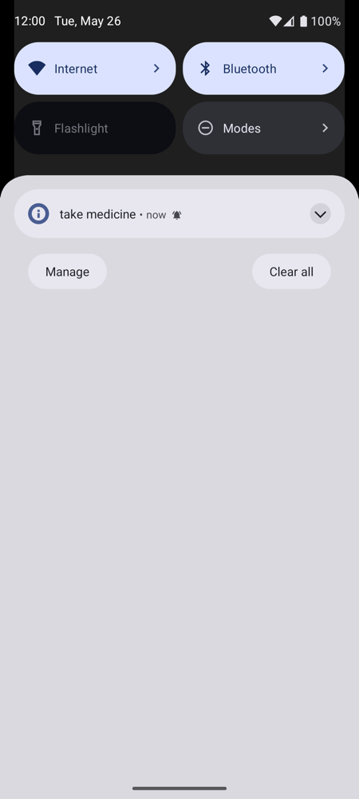

# Intelligent Reminder App

An Android app that turns natural-language conversation into smart alarms and
reminders, fully offline. Built around a small on-device LLM (Gemma 3 1B-IT via
MediaPipe `LlmInference`) for the language-understanding bits the rule-based
parser can't handle on its own.

## Screenshots

End-to-end run on a Pixel 8 Pro emulator (API 35).

| Launch | Conversation | Android integration | Alarm firing |
| :---: | :---: | :---: | :---: |
|  |  |  |  |
| Custom bell launcher icon | "Take medicine — every day at 12:00 PM (1h before lunch)" — the dependency cascade from the lunch parent | System "Alarms & reminders" page deep-linked with our app name + icon + version | Alarm fires in the notification shade after the OS scheduler picks it up |

The conversation screenshot shows the heart of the app: telling it "remind me
every day at 1 PM about lunch" and then "remind me an hour before lunch to take
medicine" makes the agent build the dependency graph itself — moving lunch
later automatically slides the medicine reminder with it.

## Two tabs (third planned)

1. **Chat** — Gemini-style dark chat. "Remind me to submit my assignment in 3
   days" → the agent figures out cadence, sets an alarm, sets pre-deadline
   notifications, learns your habits over time.
2. **Reminders** — A chronological list of everything the agent has scheduled.
   Daily activities first, then weekly, then monthly, then one-offs.
3. **Improvements** *(planned)* — Suggested habit changes and missed-reminder
   recovery flows.

## Why offline

Nothing about parsing "alarm at 7am" needs a cloud LLM. Keeping it on-device
makes it private, free to run, and works on planes / off-grid. The rule parser
handles the common 90%; the LLM is the fallback for ambiguous phrasing.

## What's intelligent about it

- **Date-based intent → alarm + cadence.** "Submit assignment in 3 days" sets
  the deadline alarm and proposes reminder pings beforehand based on the
  cadence pattern it has learned from your past acceptances.
- **Relative dependencies.** "Medicine an hour before lunch" creates a child
  reminder linked to the lunch parent. Move lunch, the child moves with it —
  cascading through arbitrary depth via BFS with cycle guard.
- **Cancel / delay / done.** Distinguishes one-time vs recurring. For recurring
  reminders, "done" advances to next occurrence; for one-time it removes.
  Acknowledgments include a "next reminder at..." line auto-generated from the
  reminder's own schedule, not a fixed template.
- **Multi-turn clarification.** If you say "an hour before lunch" but no lunch
  reminder exists, the agent asks "I don't have a 'lunch' reminder yet. When
  is it?" — and your next message is treated as the answer, not a new command.
- **Guardrails.** Title queries under 3 characters refuse to act ("do" wouldn't
  silently delete "doctor visit"). Multiple matches trigger a numbered
  disambiguation prompt, not a blind pick.

## Tech

- Jetpack Compose + Material 3, dark Gemini-style theme
- Hilt DI; Room (KSP) + DataStore Preferences
- AlarmManager — `setAlarmClock` for ALARM type, `setExactAndAllowWhileIdle`
  for NOTIFICATION type; BootCompletedReceiver re-arms after reboot
- Hybrid NLU — rule parser first (deterministic, fast), LLM fallback for
  Ambiguous intents only. LLM adapter is `MediaPipeGemmaAdapter` loading a
  ~530 MB int4 `.task` file from `filesDir/models/`.
- JUnit5 + Truth + Turbine + Robolectric + Compose UI tests; in-memory fakes
  for all I/O dependencies

## Verified end-to-end on emulator

`dumpsys alarm` confirms the schedules are registered with the system:

```
RTC_WAKEUP #21  origWhen=2026-05-26 12:00:00.000  exactAllowReason=permission
                tag=*walarm*:com.santamota.reminder.ALARM_FIRE
RTC_WAKEUP #22  origWhen=2026-05-26 13:00:00.000  exactAllowReason=permission
                tag=*walarm*:com.santamota.reminder.ALARM_FIRE
```

Advancing the device clock past the trigger time delivers the notification
(see the rightmost screenshot above), proving the full path:

```
chat input → engine → DB → AlarmScheduler → AlarmManager (system)
           ← UI ← ChatDao ← engine reply
                         → BroadcastReceiver → NotificationManager (on fire)
```

## Modules

- `app` — Compose UI, ViewModels, Activity, services
- `:domain` — pure-Kotlin data classes + business rules + dependency graph
- `:data` — Room DB, DataStore, AlarmScheduler (AlarmManager wrapper)
- `:engine` — ReminderEngine, PreferenceLearner, ConflictResolver
- `:nlu` — RuleBasedParser + LlmAdapter interface
- `:ml` — MediaPipe Gemma adapter

All non-Android modules are unit-testable with no emulator.

## Docs

- `docs/RESEARCH.md` — design decisions and trade-offs
- `docs/FLOW.md` — how a chat message becomes a scheduled alarm
- `docs/TESTING.md` — local + emulator testing recipes
- `docs/IOS_PORT.md` — what a KMP + MLX Swift port would look like
- `docs/CRITIQUE.md` — self-review and known gaps
- `docs/SETUP.md` — how to build
