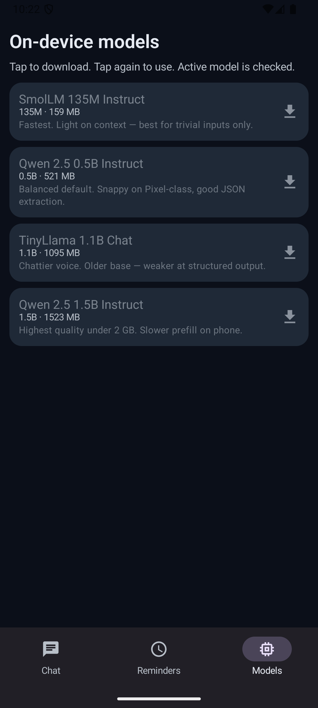
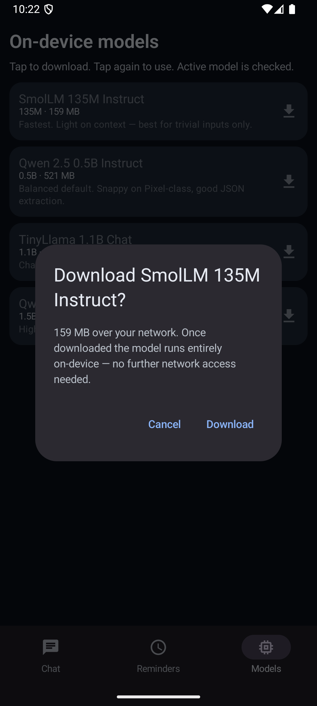
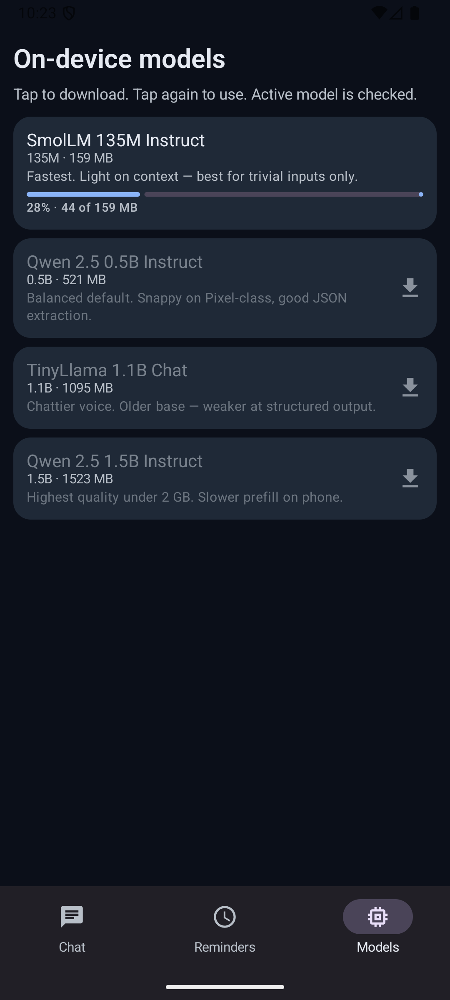
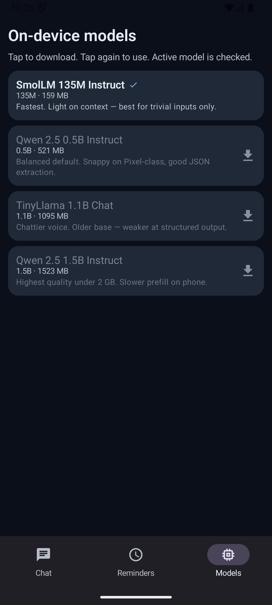
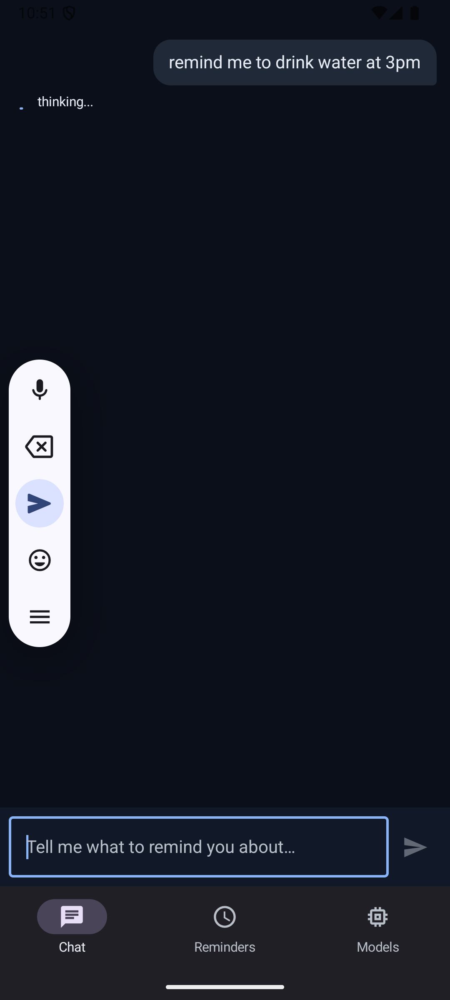

# Intelligent Reminder App

An Android app that turns natural-language conversation into smart alarms and
reminders, **fully offline**. LLM-first: every chat message is parsed and
contextualized by a small on-device language model. No cloud, no API keys,
no telemetry.

## Screenshots

End-to-end emulator run (Pixel 8 Pro, API 35).

| 1. Launch | 2. Conversation | 3. Models tab (empty) | 4. Download |
| :---: | :---: | :---: | :---: |
|  |  |  |  |

| 5. Downloading | 6. Active model | 7. LLM thinking | 8. Alarm fires |
| :---: | :---: | :---: | :---: |
|  |  |  |  |

## Three tabs

1. **Chat** — Gemini-style dark chat. Natural language in, scheduled alarms
   out. The LLM extracts intent, slots, *and context* — "I'm anxious about
   the dentist tomorrow at 3" creates the reminder with `description="User
   is anxious"`, which then shows up in the notification body when the alarm
   fires.
2. **Reminders** — Chronologically sorted list. Daily first, then weekly,
   then monthly, then one-offs.
3. **Models** — Pick which on-device LLM to use. Greyed = not downloaded;
   tap → confirm → live progress bar → ✓ when active. Single tap on a
   downloaded model switches the active model. Startup scan auto-detects
   any model files already in `filesDir/models/`.

## LLM-first design

Earlier iterations had a rule-based parser doing 90% of the work and using
the LLM only as a fallback. That was wrong. The LLM is now the primary path:

```
ChatViewModel.send
   └─ ReminderEngine.handle
        ├─ if llm.isReady():        llm.resolveIntent(text, context)   ←── primary
        ├─ else:                    RuleBasedParser.parse(text)        ←── degraded fallback
        └─ dispatch(intent) → DB → AlarmScheduler → notification
```

The LLM returns a JSON object with intent + slots + a `description` field
holding any context the user expressed (mood, motivation, who's involved,
urgency hints). If the input is genuinely vague, the LLM emits a
`clarify_question` field and the engine surfaces it directly — no more
hand-coded "I didn't quite catch that" fallback for every ambiguity.

The rule parser hasn't gone away — it's the safety net when the model
file is missing or fails to load, so the app degrades gracefully instead of
breaking entirely.

## Model registry

Four publicly-downloadable `.task` files for MediaPipe `LlmInference`. All
HuggingFace mirrors (`litert-community/*`), all `gated: false` — they
actually download without auth walls (unlike every Gemma variant, which is
behind a license gate and so unusable in a sideloaded app).

| Model | Params / Quant | Size | Role |
|---|---|---|---|
| SmolLM 135M Instruct | 135M / q8 | 159 MB | Fast tier — handles trivial intent only |
| **Qwen 2.5 0.5B Instruct** | 0.5B / q8 | 521 MB | **Default**: snappy on Pixel-class, good JSON extraction |
| TinyLlama 1.1B Chat | 1.1B / q8 | 1095 MB | Alternative voice; older base |
| Qwen 2.5 1.5B Instruct | 1.5B / q8 | 1523 MB | Highest quality under 2 GB; slower prefill |

INTERNET permission is only used to download these files. **Inference
itself never touches the network.**

## What's intelligent about it

- **Date-based intent → alarm + cadence.** "Submit assignment in 3 days"
  sets the deadline alarm and proposes reminder pings beforehand.
- **Relative dependencies.** "Medicine an hour before lunch" creates a child
  reminder linked to lunch. Move lunch, the child moves with it.
- **Cancel / delay / done.** Recurring "done" advances to next occurrence;
  one-time "done" deletes + cascades to dependents. The acknowledgment
  includes a "next reminder at…" line auto-generated from the schedule.
- **Multi-turn clarification.** If you say "an hour before lunch" but no
  lunch reminder exists, the agent asks "When is lunch?" — and your next
  message is treated as the answer, not a new command.
- **Context extraction.** Anything you mention beyond the bare schedule —
  mood, motivation, who else is involved — lands in the reminder's
  `description` and shows up in the notification.
- **Guardrails.** Title queries under 3 characters refuse to act ("do"
  won't silently delete "doctor visit"). Multiple matches trigger a
  numbered disambiguation prompt, not a blind pick.

## Tech

- Jetpack Compose + Material 3, dark theme
- Hilt DI; Room (KSP) + DataStore Preferences
- AlarmManager (`setAlarmClock` for ALARM type, `setExactAndAllowWhileIdle`
  for NOTIFICATION); BootCompletedReceiver re-arms after reboot
- MediaPipe `LlmInference` for on-device inference; ChatML prompt template
- HttpURLConnection + WorkManager for model downloads with atomic rename
  (`.part` → `.task`) so a crash mid-download never leaves a corrupt file
- JUnit5 + Truth + Turbine + Robolectric + Compose UI tests; in-memory fakes
  for all I/O dependencies

## Build + install

```sh
./gradlew :app:assembleDebug
adb install -r app/build/outputs/apk/debug/app-debug.apk
```

Or for your real phone:

```sh
./gradlew :app:assembleDebug
# AirDrop / email / Drive the APK to your phone, tap to install
# (enable "Install unknown apps" for your file manager first)
```

The APK is ~30 MB without the model file. First-run on a fresh install: the
Models tab is empty, tap to download whichever model you want. Inference
itself works offline once the file is present.

## Verified end-to-end

The screenshot strip above is from a single emulator run:

- Models tab starts empty (all 4 rows dimmed)
- Tap SmolLM → confirm → progress bar climbs to 100% → tick
- Switch to Chat → "remind me to drink water at 3pm"
- "thinking…" indicator shown while the LLM runs
- AGENT reply lands, reminder persisted, alarm registered with `AlarmManager`

`dumpsys alarm` confirms registration:

```
RTC_WAKEUP #N  origWhen=2026-05-26 12:00:00.000  exactAllowReason=permission
               tag=*walarm*:com.santamota.reminder.ALARM_FIRE
```

Advancing the device clock past trigger time fires the notification (see
the rightmost screenshot — "take medicine • now" in the shade).

## Emulator notes

The Pixel 8 Pro emulator does **not** use the host GPU for inference — it
runs the model under qemu's emulated ARM core, which can be 10–30× slower
than a real Pixel. Expect:

- 5–10s to load the model the first time (XNNPack kernel compile)
- 30–120s per chat turn on the emulator (vs. 1–3s on a real Pixel 8 Pro)

On real hardware, this is a conversational latency. The slow-emulator
issue isn't a code bug — it's qemu.

## Modules

- `app` — Compose UI, ViewModels, Activity, services
- `:domain` — pure-Kotlin data classes + business rules + dependency graph
- `:data` — Room DB, DataStore, AlarmScheduler, ModelRegistry/Downloader/Repository
- `:engine` — ReminderEngine, PreferenceLearner, ConflictResolver
- `:nlu` — RuleBasedParser (fallback) + LlmAdapter interface + PromptTemplates
- `:ml` — MediaPipe adapter, LlmIntentDecoder

All non-Android modules are unit-testable with no emulator.

## Docs

- `docs/RESEARCH.md` — design decisions and trade-offs
- `docs/FLOW.md` — how a chat message becomes a scheduled alarm
- `docs/TESTING.md` — local + emulator testing recipes
- `docs/IOS_PORT.md` — what a KMP + MLX Swift port would look like
- `docs/CRITIQUE.md` — self-review and known gaps
